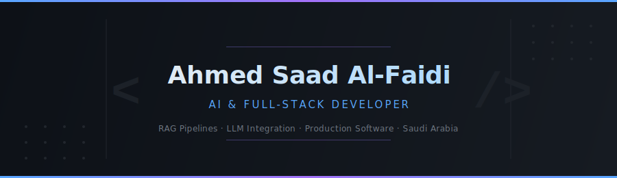

<!-- ╔═══════════════════════════════════════════════════════════════════════════╗
     ║  QUICK SETUP — fill in these 5 values before pushing to GitHub         ║
     ║  1. Replace  asaad-cs  with your real GitHub handle        ║
     ║  2. Fill in  FILL_LINKEDIN         at the link references below        ║
     ║  3. Fill in  FILL_PORTFOLIO        at the link references below        ║
     ║  4. Fill in  FILL_RFPILOT_REPO     at the link references below        ║
     ║  5. Fill in  FILL_NASKH_REPO       at the link references below        ║
     ╚═══════════════════════════════════════════════════════════════════════════╝ -->

<!-- ══════════════════════════════ HERO BANNER ══════════════════════════════ -->

<div align="center">
  
</div>

<br/>

<!-- ════════════════════════════ PROFILE BADGES ═════════════════════════════ -->

<div align="center">

[][FILL_LINKEDIN]&nbsp;
[][FILL_PORTFOLIO]&nbsp;
[](mailto:ahmed.s.alfaidi@gmail.com)&nbsp;
[](https://github.com/asaad-cs)

</div>

<br/>

<!-- ══════════════════════════════ ABOUT ME ══════════════════════════════════ -->

## About Me

Computer Science graduate from **Taibah University** · Madinah, Saudi Arabia · 2026

I build production AI systems — not just demos. My work sits at the intersection of **LLM integration**, **RAG architectures**, and **full-stack engineering**.

- 🤖 Integrated **GPT-4o tool-calling** into a live RFP platform with **pgvector RAG** — resolving a defect where the chatbot retrieved from a single document instead of the full dataset
- 📄 Built the React review UI and Pydantic schema for an AI document verifier that cut human review load by **80%** at a national hackathon
- 🏢 Delivered a **production HRMS** for a real Saudi company as my graduation project — with RBAC, normalized DB, and technical docs adopted by the IT team
- 🎓 Currently pursuing **AWS Certified AI Practitioner**

> Seeking an entry-level role in **AI Engineering** or **Full-Stack Development**

<br/>

<!-- ════════════════════════════ CURRENT FOCUS ══════════════════════════════ -->

## Current Focus

```yaml
certification:  "AWS Certified AI Practitioner — in progress (2026)"
deepening:      ["RAG pipeline design", "LLM tool-calling", "vector databases (pgvector)"]
target_roles:   ["AI Engineer", "Full-Stack Developer", "ML Engineer (entry-level)"]
location:       "Saudi Arabia · open to remote"
languages:      ["Arabic (Native)", "English (Professional Working Proficiency)"]
```

<br/>

<!-- ══════════════════════════════ TECH STACK ════════════════════════════════ -->

## Tech Stack

**AI & Data**

[](https://skillicons.dev)

`OpenAI API (GPT-4o · GPT-3.5-turbo)` &nbsp; `pgvector` &nbsp; `RAG Pipelines` &nbsp; `AWS Bedrock` &nbsp; `Pydantic` &nbsp; `Jupyter`

**Web & Frontend**

[](https://skillicons.dev)

**Databases**

[](https://skillicons.dev)

`SQLAlchemy` &nbsp; `pgvector`

**DevOps & Tools**

[](https://skillicons.dev)

**Networking & Security**

`TCP/IP` &nbsp; `VLANs` &nbsp; `ACLs` &nbsp; `Firewall Configuration` &nbsp; `Cisco Packet Tracer`

<br/>

<!-- ════════════════════════════ FEATURED PROJECTS ══════════════════════════ -->

## Featured Projects

### 🧠 RFPilot — AI-Powered RFP Management Platform

> Python Bootcamp · Saudi Digital Academy · Jun 2026 &nbsp;|&nbsp; [][FILL_RFPILOT_REPO]

Intelligent platform for managing Requests for Proposal — powered by GPT-4o tool-calling and semantic search over a live PostgreSQL database.

| Component | What I built |
|---|---|
| **AI Chat** | GPT-4o tool-calling assistant grounded in live PostgreSQL via pgvector similarity search — fixed a defect where the chatbot retrieved from a single document instead of the full dataset |
| **Extraction Pipeline** | GPT-3.5-turbo integration that converts raw PDF uploads into structured summaries, requirements, deadlines, and bid scores automatically |
| **Auth System** | JWT + bcrypt authentication UI wired to FastAPI backend with RBAC across admin and user roles |

`Python` &nbsp; `FastAPI` &nbsp; `OpenAI API` &nbsp; `pgvector` &nbsp; `PostgreSQL` &nbsp; `React` &nbsp; `Docker` &nbsp; `JWT`

---

### 📜 Naskh (نسخ) — AI Document Verification System

> WeCloudData × Saudi Digital Academy Hackathon · Jun 2026 &nbsp;|&nbsp; [][FILL_NASKH_REPO]

AI-powered pipeline for verifying the digitization of handwritten Arabic manuscripts, with confidence-based routing to minimize human review.

| Component | Details |
|---|---|
| **Review UI** | React interface connecting OCR extraction → verifier agent → human review workflow |
| **Pydantic Schema** | Shared data contract across all pipeline stages (OCR, verifier, frontend) |
| **Confidence Router** | Auto-accepts high-confidence fields; routes uncertain ones for HITL pre-filled with a suggested correction |

**Results on real historical manuscripts:** ↓ 80% human review load &nbsp;·&nbsp; ↑ field accuracy 77.5% → 81.2%

`Python` &nbsp; `FastAPI` &nbsp; `React` &nbsp; `Pydantic` &nbsp; `OCR` &nbsp; `PostgreSQL` &nbsp; `Docker`

---

### 🏢 Al-Sanad HRMS — Full-Stack HR Management System

> Graduation Project · Al-Sanad Al-Afdal Company, Yanbu · Jan 2025 – Jan 2026

Production HRMS delivered to a real Saudi company, replacing manual HR workflows end-to-end and adopted into their IT infrastructure.

| Component | Details |
|---|---|
| **System** | Full employee lifecycle management — centralized onboarding, records, and offboarding |
| **Database** | Normalized relational schema with optimized queries across all HR modules |
| **Security** | RBAC with secure backend logic; technical documentation adopted by the company's IT team |

`PHP` &nbsp; `JavaScript` &nbsp; `MySQL` &nbsp; `RBAC`

<br/>

<!-- ════════════════════════════ GITHUB STATISTICS ══════════════════════════ -->

## GitHub Statistics

<div align="center">


&nbsp;&nbsp;


</div>

<br/>

<div align="center">
  
</div>

<br/>

<!-- ══════════════════════════ CERTIFICATIONS ════════════════════════════════ -->

## Certifications & Training

| Status | Certification | Issuer | Date |
|:---:|---|---|:---:|
| 🔄 In Progress | **AWS Certified AI Practitioner** | Amazon Web Services · via Saudi Digital Academy | 2026 |
| ✅ Completed | **Python Software Development Bootcamp** | Saudi Digital Academy | Jun 2026 |
| ✅ Completed | **Data & AI Program** | Red Sea Global | Mar 2026 |
| ✅ Completed | **Cybersecurity Track** | Satr Platform | 2025 |

<br/>

<!-- ══════════════════════════════ CONNECT ═══════════════════════════════════ -->

## Connect

<div align="center">

[][FILL_LINKEDIN]&nbsp;
[][FILL_PORTFOLIO]&nbsp;
[](mailto:ahmed.s.alfaidi@gmail.com)&nbsp;
[](https://github.com/asaad-cs)

</div>

<br/>

<!-- ════════════════════════════════ FOOTER ══════════════════════════════════ -->

<div align="center">
  <sub>
    <b>Ahmed Saad Al-Faidi</b> &nbsp;·&nbsp; CS Graduate · Taibah University · 2026 &nbsp;·&nbsp;
    <a href="mailto:ahmed.s.alfaidi@gmail.com">Open to AI Engineering & Full-Stack roles</a>
    <br/><br/>
    
  </sub>
</div>

<!-- ══════════════════════════ LINK REFERENCES ═══════════════════════════════
     Fill in your actual URLs here. All badges above resolve through these.   -->

[FILL_LINKEDIN]:     https://www.linkedin.com/in/ahmed-alfaidi-752b6b244/
[FILL_PORTFOLIO]:    https://ahmesfdportfolio.netlify.app/
[FILL_RFPILOT_REPO]: https://github.com/asaad-cs/RFPilot
[FILL_NASKH_REPO]:   https://github.com/asaad-cs/Naskh
